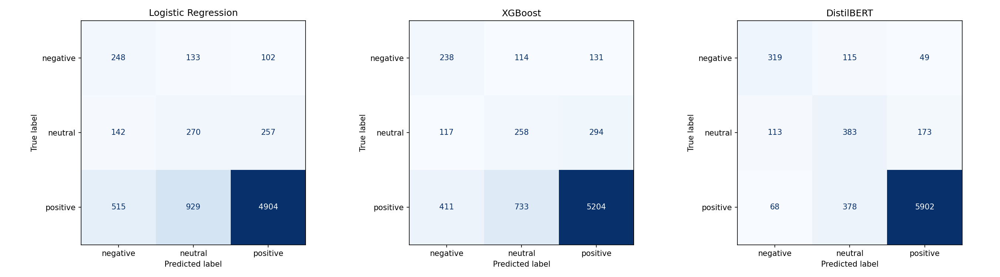
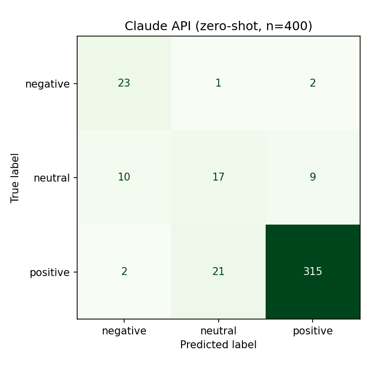
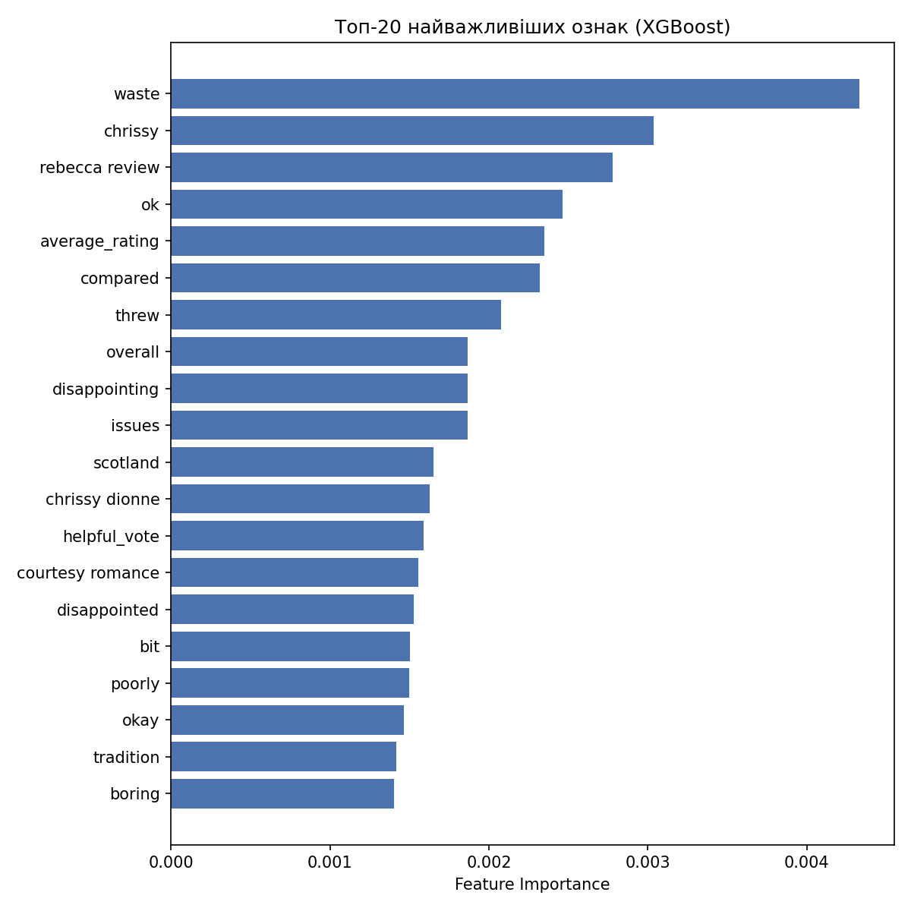
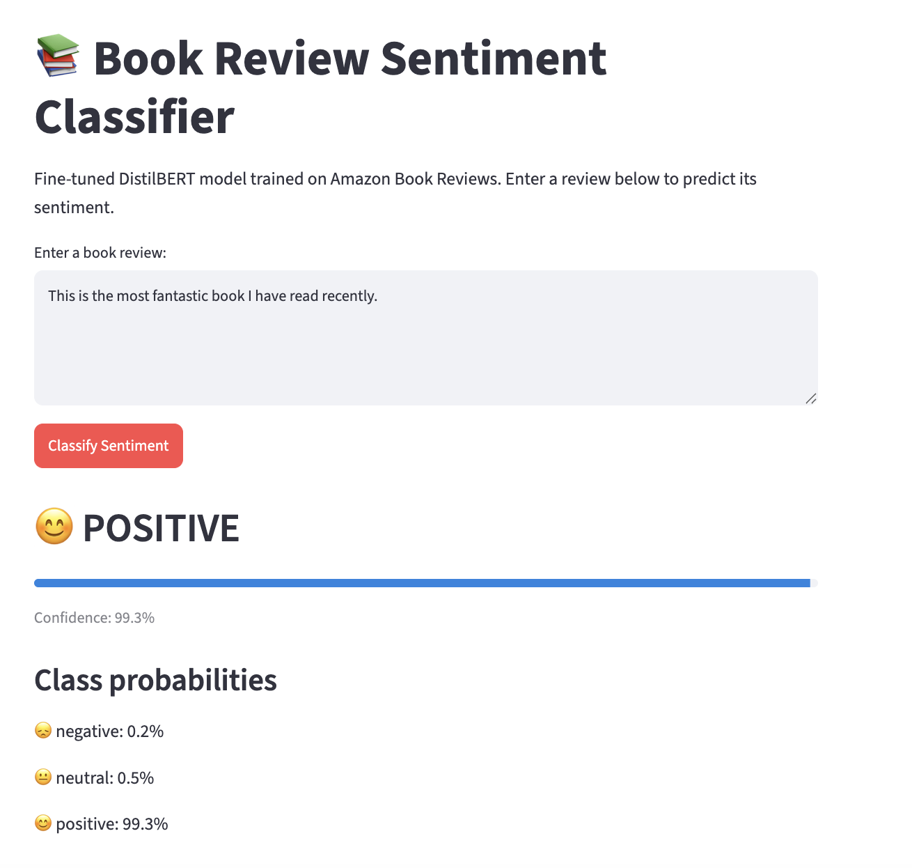
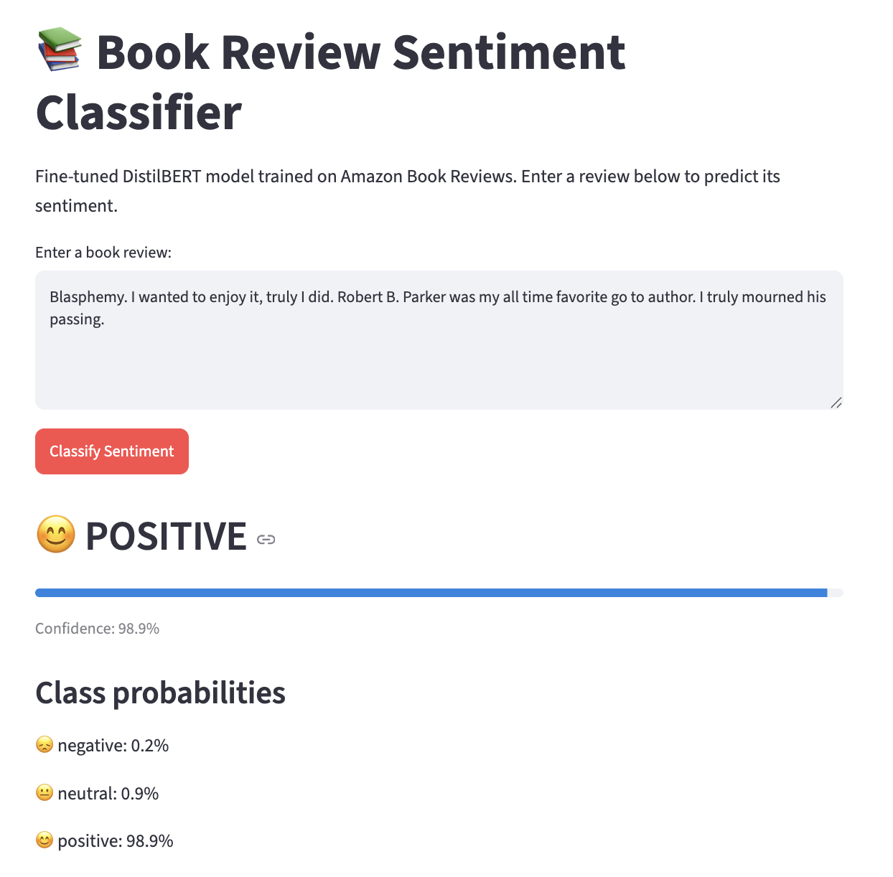

# Project Structure 
```
Amazon_Books_project/
├── README.md
├── requirements.txt
├── data/
│   └── README.md
├── notebooks/
│   ├── 01_eda.ipynb
│   ├── 02_feature_engineering.ipynb
│   ├── 03_baseline.ipynb
│   └── 04_models.ipynb
├── src/
│   ├── preprocessing.py
│   ├── models.py
│   └── evaluation.py
├── models/
│   └── distilbert_model/   # weights via Google Drive link above
└── reports/                # EDA & evaluation plots
```

# Amazon_Books_project
Sentiment classification on Amazon Book Reviews using TF-IDF+XGBoost, fine-tuned DistilBERT, and LLM API — with EDA, imbalanced learning, and business insights.

This project demonstrates:

- **Feature engineering** for NLP tasks on real-world, messy data
- A comparison of **classical ML, fine-tuned transformer, and LLM API** approaches to classification
- Handling **imbalanced classes**
- **Business-oriented interpretation** of results

These are core skills expected in modern Data Scientist roles across fintech, product, and data-driven companies.

## Data Source
Full dataset: McAuley-Lab/Amazon-Reviews-2023 (Books category), Hugging Face
https://huggingface.co/datasets/McAuley-Lab/Amazon-Reviews-2023

Run `src/download_data.py` to reproduce the sample used in this project
(50,000 reviews, seed=42).

## Sampling Note

This project uses a random sample of 50,000 reviews out of an estimated 
~29-30 million reviews in the Books category of the full Amazon Reviews 2023 
dataset (based on the 20.1GB raw file size), representing less than 0.2% of 
the full category. While the sample preserves realistic class imbalance and 
diversity, results may not fully generalize to the entire book catalog on Amazon 
(e.g., very niche or non-English titles may be underrepresented).

## Exploratory Data Analysis (EDA)

### Target Variable Distribution
The dataset is highly imbalanced: **84.6% of reviews are positive** (rating 4-5), 
**8.9% neutral** (rating 3), and only **6.4% negative** (rating 1-2). This reflects 
a common pattern in e-commerce reviews — satisfied customers are more likely to 
leave feedback. This imbalance directly informed our choice to use **macro F1** 
as the primary metric and to apply class-weighting / resampling techniques 
during modeling.

### Text Length by Sentiment
Interestingly, **neutral reviews tend to be longer** (median ~600 characters) 
than both negative (~290) and positive (~310) reviews. A likely explanation: 
users giving a middling rating often explain both pros and cons in detail, 
while strongly positive or negative reactions tend to be shorter and more emotional.

### Numeric Feature Distributions
All count-based features (`price`, `helpful_vote`, `rating_number`, `text_length`) 
are strongly right-skewed, typical of e-commerce data. `average_rating` is the 
exception, roughly normally distributed around 4.3–4.7 — most books in the 
dataset are already well-rated, which limits its usefulness as a standalone 
predictive feature.

### Correlation Analysis
Correlations among numeric features are weak overall (|r| ≤ 0.16), meaning no 
single tabular feature strongly predicts sentiment. The two mildest patterns: 
`text_length` correlates positively with `helpful_vote` (r=0.16, longer reviews 
are seen as more helpful) and negatively with `average_rating` (r=-0.12, slightly 
longer reviews tend to accompany lower-rated books). This confirms that **text 
content is the primary signal** for this classification task, not tabular metadata.

### Top Words by Sentiment Class
After removing HTML artifacts (`<br>` tags, HTML entities) from the raw review 
text, word-frequency analysis revealed:
- Negation words (**"don't", "didn't"**) appear almost exclusively in negative reviews
- **"great"** is a strong positive-only marker
- Common words (*book, read, story, author*) dominate across all classes, 
  suggesting bigrams or a custom tokenizer preserving negations (e.g. "didn't like") 
  would improve signal quality over single-word (unigram) features

### Verified Purchase vs. Sentiment
Verified purchases show slightly more polarized sentiment (6.9% negative, 85.5% 
positive) compared to non-verified ones (5.9% negative, 83.5% positive, but 10.6% 
neutral). This suggests customers who actually paid for the product tend to have 
stronger opinions — either very satisfied or genuinely disappointed — while 
non-verified reviewers are more likely to stay neutral.

### Data Quality
One extreme price outlier ($4,975.50) was investigated and found to be a 
legitimate rare/collectible book listing rather than a parsing error, and was 
therefore retained in the dataset.

## Baseline Model

A `most-frequent-class` baseline achieves 84.6% accuracy — but this is misleading:
it never predicts `negative` or `neutral` at all (0% recall for both), simply because
`positive` dominates the dataset. **Macro F1 of 0.31** exposes this weakness clearly, 
confirming our earlier EDA decision to use macro F1 as the primary evaluation metric 
rather than accuracy. Any model that beats this baseline must demonstrate real 
predictive power on the minority classes, not just overall accuracy.

## Model 1: Logistic Regression (TF-IDF + tabular features)

Logistic Regression with `class_weight="balanced"` improves macro F1 from 0.31 
(baseline) to **0.49** — a substantial gain in the model's ability to detect 
minority classes (negative recall: 0% → 51%, neutral recall: 0% → 40%).

This comes at the cost of overall accuracy (84.6% → 72.2%), since the model now 
misclassifies some `positive` reviews as `negative`/`neutral` in exchange for much 
better minority-class detection. This is the expected and desirable trade-off when 
optimizing for macro F1 rather than accuracy — for a real business use case 
(e.g., flagging negative reviews for customer support), catching more true 
negatives matters more than raw accuracy on the already-easy majority class.

Precision for `negative` (0.27) and `neutral` (0.20) remains low, meaning the model 
still generates many false positives for these classes — an area for improvement 
with more sophisticated models (fine-tuned transformers, ensemble methods).

## Model 2: XGBoost (TF-IDF + tabular features)

XGBoost was trained on the same feature set as Logistic Regression (TF-IDF text 
vectors + tabular features), using `sample_weight` to address class imbalance.

**Initial run** (n_estimators=300, max_depth=6, learning_rate=0.1): 
macro F1 = **0.524**, accuracy = 77.2%.

**Hyperparameter tuning:** A `RandomizedSearchCV` (4 candidates × 2-fold CV, 
scoring=`f1_macro`) was run over `n_estimators`, `max_depth`, and `learning_rate`. 
Due to compute constraints in Colab (a full search on the 35k training set was 
computationally prohibitive), tuning was performed on a **10k stratified subsample**. 
The best configuration found (n_estimators=200, max_depth=5, learning_rate=0.2) 
achieved a CV macro F1 of 0.573 on the subsample.

**Limitation:** When this best configuration was retrained on the full 35k 
training set and evaluated on the full validation set, it performed slightly 
worse (macro F1 = 0.514) than the original untuned configuration (macro F1 = 0.524). 
This suggests that hyperparameters optimal on a subsample do not always transfer 
perfectly to the full-scale model — a known trade-off of this tuning strategy 
under compute constraints.

**Final choice:** Given this result, the original configuration 
(n_estimators=300, max_depth=6, learning_rate=0.1, macro F1 = 0.524) was retained 
as the representative XGBoost result for comparison with other models, since it 
achieved the best validation performance in practice.

| Model | Params | Val Accuracy | Val Macro F1 | Train Time |
|---|---|---|---|---|
| XGBoost (initial) | n_estimators=300, max_depth=6, lr=0.1 | 77.2% | **0.524** | ~16 min |
| XGBoost (tuned on 10k subsample) | n_estimators=200, max_depth=5, lr=0.2 | 76.0% | 0.514 | ~10 min |

## Model 3: Fine-tuned DistilBERT

DistilBERT, fine-tuned on an 10k stratified subsample of raw review text (3 epochs, 
weighted cross-entropy loss), substantially outperforms both classical approaches:

| Model | Val Accuracy | Val Macro F1 |
|---|---|---|
| Logistic Regression (TF-IDF) | 72.2% | 0.489 |
| XGBoost (TF-IDF + tabular) | 77.2% | 0.524 |
| **DistilBERT (fine-tuned)** | **88.1%** | **0.697** |

Unlike the TF-IDF-based models, DistilBERT captures contextual and sequential 
information in the text (e.g., negation handling, word order), which explains 
the marked improvement in both negative recall (66% vs 50%) and neutral recall 
(57% vs 40%). This confirms that for nuanced sentiment classification, a 
transformer-based approach captures signal that bag-of-words methods miss — 
despite being fine-tuned on a smaller subsample (10k vs 35k for classical models).

## Models
Due to file size constraints, trained model weights are not included in this 
repository. To reproduce them:

1. Run `notebooks/04_models.ipynb` — this will train and save:
   - `models/xgb_model.pkl`
   - `models/distilbert_model/`

Alternatively, [download pre-trained weights from Google Drive](https://drive.google.com/file/d/1EYgMNTw2Q4Trp6cuduyuK-QwdB2_90nx/view?usp=sharing) (250 MB total).

- XGBoost model and TF-IDF pipeline are not included; they can be regenerated by 
  running `notebooks/02_feature_engineering.ipynb` → `notebooks/04_models.ipynb`

## Model Comparison & Error Analysis

### Summary Table

| Model | Val Accuracy | Val Macro F1 | Train Time |
|---|---|---|---|
| Baseline (most frequent) | 84.6% | 0.306 | ~0 sec |
| Logistic Regression (TF-IDF + tabular) | 72.2% | 0.489 | 39 sec |
| XGBoost (TF-IDF + tabular, tuned) | 77.2% | 0.524 | ~16 min |
| DistilBERT (fine-tuned, 10k subsample) | 88.1% | 0.697 | ~14 min |
| Claude API (zero-shot, n=400 subsample) | 88.8% | **0.719** | 0 sec (no training) |

DistilBERT and Claude API clearly outperform the classical ML approaches, 
confirming that contextual/sequential understanding of text matters more than 
bag-of-words features (TF-IDF) for this nuanced sentiment task.

### Note on Claude API Evaluation
Unlike the other three models, the Claude API (zero-shot) was evaluated on a 
smaller, stratified subsample of 400 validation examples rather than the full 
7,500-example validation set, due to API cost and latency constraints (~1.7s 
per request). Its confusion matrix is therefore shown separately and should not 
be directly compared cell-by-cell with the other three models, though the 
overall macro F1 and accuracy remain meaningful for comparison since the 
subsample preserves the original class proportions.

### Confusion Matrix Analysis




Across all models, the most common error is confusing **neutral with positive** 
reviews (a "soft" error, since these are semantically adjacent classes), rather 
than confusing negative with positive (a "hard" error).

DistilBERT shows the fewest hard errors: only 49 negative reviews were 
misclassified as positive (vs. 102 for Logistic Regression and 131 for XGBoost), 
suggesting the transformer better captures sentiment polarity through context 
rather than relying on individual keyword presence.

### Feature Importance (XGBoost)



The most influential features fall into two groups: (1) genuine sentiment 
markers — `waste`, `disappointing`, `disappointed`, `poorly`, `boring`, `okay` — 
which align with expected negative/neutral language; and (2) proper nouns 
(`chrissy`, `rebecca review`, `scotland`) that likely correspond to specific 
authors or reviewers whose books consistently received particular ratings in 
the training set. This second group is a sign of mild overfitting to specific 
entities rather than generalizable sentiment patterns — a limitation worth 
addressing in future work (e.g., by removing named entities during preprocessing 
or increasing training data diversity).

### Qualitative Error Examples

Most misclassifications share a common pattern: **sarcasm, irony, or indirect 
criticism** that doesn't rely on explicit negative keywords, as well as **sentiment 
shifts** within a single review that the model fails to fully track.

**Example 1 — Sarcasm/irony not recognized (false positive)**

> "Blasphemy. I wanted to enjoy it, truly I did. Robert B. Parker was my all 
> time favorite go to author. I truly mourned his passing..."

- **True label:** negative
- **Predicted:** positive

The reviewer uses reverent, seemingly positive language ("all time favorite", 
"mourned his passing") to set up an ironic contrast with their actual 
disappointment. The model picks up on the surface-level positive vocabulary 
without recognizing the sarcastic framing.

**Example 2 — Sentiment shift not tracked (false negative)**

> "Omg finally I understand. I hated puzzle caches...just because they confused 
> me or I thought they made no sense. Now I'm attempting them with better 
> understanding and success."

- **True label:** positive
- **Predicted:** negative

The review opens with a strong negative word ("hated") describing a *past* 
frustration, then pivots to a clearly positive resolution ("better understanding 
and success"). The model appears to over-weight the early negative signal 
without adjusting for the sentiment shift later in the text.

**Takeaway:** Both classical and transformer-based models struggle with 
sarcasm and sentiment shifts within a single review. Addressing this would 
likely require larger fine-tuning datasets with more diverse sarcastic/mixed-
sentiment examples, or explicit discourse-level modeling that tracks sentiment 
across sentence boundaries rather than treating the review as a single 
bag-of-context input.

## Business Insights & Recommendations

- **Customer support prioritization:** Automatic flagging of negative reviews 
  (66-88% recall depending on model) enables faster triage for customer support 
  teams, reducing manual review time.
- **Product quality monitoring:** Aggregating predicted sentiment trends over 
  time per book/category could surface emerging quality issues before they 
  escalate.
- **Cost vs. performance trade-off:** For high-volume, real-time classification, 
  a locally-hosted fine-tuned model (DistilBERT) is more cost-effective than 
  per-request LLM API calls, despite Claude API's marginally higher accuracy.

  ## Conclusions

- **Best performing model:** Claude API (zero-shot) achieved the highest macro F1 
  (0.719), closely followed by fine-tuned DistilBERT (0.697) — both substantially 
  outperforming classical ML approaches (TF-IDF + XGBoost/Logistic Regression).
- **Practical choice for deployment:** DistilBERT is recommended for production 
  use due to its balance of strong performance, sub-second local inference, and 
  no per-request cost — unlike the LLM API, which incurs latency and cost at scale.
- **Key limitation:** All models struggle with sarcasm and reviews containing 
  sentiment shifts, and XGBoost showed mild overfitting to specific named entities 
  (author/reviewer names) rather than generalizable language patterns.
- **Future improvements:** Larger fine-tuning datasets, removing named entities 
  from features, ensemble methods combining DistilBERT + XGBoost, and explicit 
  negation-aware tokenization (bigrams) could further improve minority-class recall.

  ## Installation & Usage

1. Clone the repository:
```bash
   git clone https://github.com/yourusername/Amazon_Books_project.git
   cd Amazon_Books_project
   pip install -r requirements.txt
```
2. Download the data sample:
```bash
   python src/download_data.py
```
3. Run notebooks in order: `01_eda.ipynb` → `02_feature_engineering.ipynb` → 
   `03_baseline.ipynb` → `04_models.ipynb`

   
## Live Demo

Try the deployed model here: **[amazonbooksproject-tetianamar.streamlit.app](https://amazonbooksproject-tetianamar.streamlit.app/)**

**Example — correct positive classification:**


**Example — known limitation (sarcasm/irony not detected):**


This second example ("Blasphemy... I truly mourned his passing") illustrates 
the sarcasm-detection limitation discussed in the [Qualitative Error Examples](#qualitative-error-examples) 
section above — the model reads surface-level positive/neutral language 
without recognizing the ironic, disappointed tone.

## Video Presentation

[Loom video walkthrough (5 min)](https://www.loom.com/share/90c0d2cdf0544d8f8a0aa8b07162ba03) — problem statement, data, models, 
results, and business applications.
